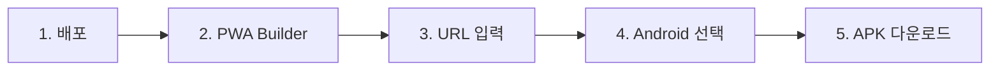

# 📱 Android APK 배포 파일 생성 가이드

## 🎯 개요

현재 증산도 경주 노서도장 웹 애플리케이션은 **PWA (Progressive Web App)**로 구현되어 있습니다. 
이를 **Android APK 파일**로 변환하여 Google Play 스토어에 등록하거나 직접 배포할 수 있습니다.

## 🌟 방법 비교

| 방법 | 난이도 | 비용 | 시간 | 품질 | 추천도 |
|------|--------|------|------|------|--------|
| **PWA Builder** | ⭐ 쉬움 | 무료 | 5분 | ⭐⭐⭐⭐⭐ | ✅ **강력추천** |
| **Trusted Web Activity** | ⭐⭐ 보통 | 무료 | 30분 | ⭐⭐⭐⭐⭐ | ✅ 추천 |
| **Apache Cordova** | ⭐⭐⭐ 어려움 | 무료 | 2시간 | ⭐⭐⭐⭐ | 가능 |
| **React Native WebView** | ⭐⭐⭐⭐ 매우 어려움 | 무료 | 4시간 | ⭐⭐⭐ | 비추천 |

---

## 🚀 방법 1: PWA Builder (가장 쉬운 방법)

### 특징
- ✅ **완전 무료**
- ✅ **코드 수정 불필요**
- ✅ **5분 내 APK 생성**
- ✅ **Google Play 스토어 등록 가능**
- ✅ **자동 업데이트 지원**

### 필수 조건

현재 프로젝트는 이미 모든 조건을 만족합니다:
- ✅ manifest.json 파일 존재
- ✅ service-worker.js 파일 존재
- ✅ PWA 아이콘 (192x192, 512x512)
- ✅ HTTPS 배포 필요 (Publish 탭에서 배포 후)

### 단계별 가이드

#### 1단계: 웹사이트 배포

먼저 웹사이트를 온라인에 배포해야 합니다.

1. **Publish 탭 클릭**
2. **배포 완료**
3. **배포 URL 복사** (예: https://your-site.netlify.app)

#### 2단계: PWA Builder 접속

1. [PWA Builder](https://www.pwabuilder.com/) 웹사이트 접속
2. 배포된 URL 입력
3. **"Start"** 버튼 클릭

#### 3단계: PWA 점수 확인

PWA Builder가 자동으로 웹사이트 분석:
- **Manifest**: ✅ (이미 있음)
- **Service Worker**: ✅ (이미 있음)
- **HTTPS**: ✅ (배포 후)
- **Icons**: ✅ (이미 있음)

#### 4단계: Android 패키지 생성

1. 페이지 하단으로 스크롤
2. **"Store Package"** 섹션에서 **Android** 선택
3. 다음 정보 입력:

```
Package ID: kr.or.jsd.gyeongju.noseo
App Name: 증산도 경주 노서도장
App Version: 1.0.0
Version Code: 1

Host: [배포된 URL]
Start URL: /

Theme Color: #C8102E
Background Color: #FFFFFF

Display Mode: standalone
Orientation: any
```

4. **"Generate"** 버튼 클릭
5. **APK 다운로드** (약 1-2분 소요)

#### 5단계: APK 설치 및 테스트

1. 다운로드한 ZIP 파일 압축 해제
2. `app-release.apk` 파일 찾기
3. Android 기기로 전송
4. 설치 및 테스트

### PWA Builder 고급 설정

#### 커스터마이징 옵션

1. **Splash Screen (스플래시 화면)**
   - 앱 시작 시 표시되는 화면
   - 로고 이미지 업로드 가능

2. **Shortcuts (바로가기)**
   - 앱 아이콘 롱프레스 시 표시
   - 주요 페이지 바로가기 추가

3. **Screenshots (스크린샷)**
   - Google Play 등록용
   - 앱 화면 캡처 이미지

4. **Signing Key (서명 키)**
   - Google Play 업로드용
   - 자동 생성 또는 기존 키 사용

---

## 🔧 방법 2: Trusted Web Activity (TWA)

### 특징
- ✅ **네이티브 앱처럼 작동**
- ✅ **Chrome 브라우저 없이 실행**
- ✅ **Google Play 스토어 등록 가능**
- ⚠️ Android Studio 필요

### 단계별 가이드

#### 1단계: 웹사이트 배포 (필수)

PWA Builder와 동일하게 먼저 배포 필요

#### 2단계: Bubblewrap 설치

[Bubblewrap](https://github.com/GoogleChromeLabs/bubblewrap)은 Google에서 만든 TWA 생성 도구입니다.

**필요한 것:**
- Node.js 설치
- JDK 8 이상 설치

**설치 명령:**
```bash
npm install -g @bubblewrap/cli
```

#### 3단계: TWA 프로젝트 생성

```bash
bubblewrap init --manifest https://your-site.netlify.app/manifest.json
```

**질문에 답변:**
```
Domain: your-site.netlify.app
Application Name: 증산도 경주 노서도장
Package Name: kr.or.jsd.gyeongju.noseo
Icon URL: https://your-site.netlify.app/images/icon-512x512.png
Theme Color: #C8102E
Background Color: #FFFFFF
Start URL: /
Display Mode: standalone
Orientation: any
```

#### 4단계: APK 빌드

```bash
bubblewrap build
```

**생성 위치:**
```
./app-release-signed.apk
```

#### 5단계: 설치 및 테스트

Android 기기에 APK 설치하여 테스트

### TWA 장점

1. **Chrome Custom Tabs 사용**
   - 빠른 로딩
   - 자동 로그인 유지
   - 보안 강화

2. **네이티브 느낌**
   - 주소창 없음
   - 전체 화면
   - 시스템 통합

3. **자동 업데이트**
   - 웹사이트 업데이트 시 자동 반영
   - APK 재배포 불필요

---

## 📦 방법 3: Apache Cordova

### 특징
- ⚠️ 복잡한 설정
- ✅ 완전한 제어 가능
- ✅ 네이티브 기능 접근 가능

### 간단한 가이드

#### 1단계: Cordova 설치

```bash
npm install -g cordova
```

#### 2단계: 프로젝트 생성

```bash
cordova create jsd-noseo kr.or.jsd.gyeongju.noseo "증산도 노서도장"
cd jsd-noseo
```

#### 3단계: Android 플랫폼 추가

```bash
cordova platform add android
```

#### 4단계: 웹 파일 복사

현재 프로젝트의 모든 파일을 `www/` 폴더에 복사

#### 5단계: config.xml 설정

```xml
<?xml version='1.0' encoding='utf-8'?>
<widget id="kr.or.jsd.gyeongju.noseo" version="1.0.0" xmlns="http://www.w3.org/ns/widgets">
    <name>증산도 경주 노서도장</name>
    <description>
        후천가을 문명시대를 준비하는 증산도 경주 노서도장
    </description>
    <author email="contact@jsd-noseo.kr">
        증산도 경주 노서도장
    </author>
    <content src="index.html" />
    <access origin="*" />
    <preference name="DisallowOverscroll" value="true" />
    <preference name="android-minSdkVersion" value="22" />
    <preference name="android-targetSdkVersion" value="33" />
</widget>
```

#### 6단계: APK 빌드

```bash
cordova build android --release
```

**생성 위치:**
```
platforms/android/app/build/outputs/apk/release/app-release-unsigned.apk
```

---

## 🎯 현재 상태에서 가장 쉬운 방법

### PWA Builder 사용 (5분 완료)



#### 즉시 실행 가능한 단계

1. **Publish 탭에서 배포**
   - Netlify 또는 Vercel 선택
   - 배포 완료 (2-3분)
   - URL 복사

2. **PWA Builder 접속**
   - https://www.pwabuilder.com/
   - URL 입력 및 분석

3. **Android 패키지 생성**
   - 정보 입력
   - APK 다운로드

4. **설치 및 공유**
   - Android 기기에 설치
   - 가족/친구와 공유

---

## 📱 APK 배포 방법

### 방법 1: 직접 배포 (비공식)

**장점:**
- 즉시 배포 가능
- 심사 불필요
- 무료

**방법:**
1. APK 파일을 클라우드에 업로드
   - Google Drive
   - Dropbox
   - 도장 웹사이트
2. 다운로드 링크 공유
3. 사용자가 직접 설치

**설치 방법 안내:**
```
1. APK 파일 다운로드
2. 설정 > 보안 > "알 수 없는 소스" 허용
3. 다운로드한 APK 파일 실행
4. 설치 진행
```

### 방법 2: Google Play 스토어 (공식)

**장점:**
- 신뢰성 높음
- 자동 업데이트
- 검색 가능

**단점:**
- 심사 필요 (2-3일)
- 개발자 등록 비용 ($25, 평생)

**단계:**
1. [Google Play Console](https://play.google.com/console) 접속
2. 개발자 계정 생성 ($25 결제)
3. 새 앱 만들기
4. APK 업로드
5. 스토어 등록 정보 작성
6. 심사 제출

### 방법 3: Samsung Galaxy Store (선택사항)

**장점:**
- 삼성 기기 사용자 접근 용이
- 무료 등록

---

## 🔒 APK 서명 (Signing)

### Google Play 업로드용 서명

#### 키 생성

```bash
keytool -genkey -v -keystore jsd-noseo.keystore -alias jsd-noseo -keyalg RSA -keysize 2048 -validity 10000
```

**정보 입력:**
```
이름: 증산도 경주 노서도장
조직 단위: IT
조직: 증산도
시/도: 경상북도
국가: KR
```

#### APK 서명

```bash
jarsigner -verbose -sigalg SHA1withRSA -digestalg SHA1 -keystore jsd-noseo.keystore app-release-unsigned.apk jsd-noseo
```

#### Zipalign

```bash
zipalign -v 4 app-release-unsigned.apk jsd-noseo-release.apk
```

---

## 📊 앱 크기 최적화

### 현재 예상 크기

- **PWA Builder APK**: 약 1-2MB
- **TWA APK**: 약 2-3MB
- **Cordova APK**: 약 5-10MB

### 최적화 팁

1. **이미지 압축**
   - 아이콘 최적화
   - WebP 형식 사용

2. **코드 최소화**
   - JavaScript minify
   - CSS minify

3. **불필요한 파일 제거**
   - 테스트 파일
   - 문서 파일

---

## 🧪 테스트 체크리스트

### 기능 테스트

- [ ] 앱 설치
- [ ] 앱 실행
- [ ] 모든 페이지 탐색
- [ ] 로그인/로그아웃
- [ ] 게시글 작성
- [ ] 이미지 업로드
- [ ] 카카오톡 공유
- [ ] 외부 링크 클릭

### 성능 테스트

- [ ] 로딩 속도
- [ ] 스크롤 부드러움
- [ ] 메모리 사용량
- [ ] 배터리 소모

### 호환성 테스트

- [ ] Android 8.0 (API 26)
- [ ] Android 9.0 (API 28)
- [ ] Android 10.0 (API 29)
- [ ] Android 11.0 (API 30)
- [ ] Android 12.0 (API 31)
- [ ] Android 13.0 (API 33)

---

## 🎨 아이콘 준비 (이미 완료)

현재 프로젝트에는 이미 아이콘이 준비되어 있습니다:

- ✅ `images/icon-72x72.png`
- ✅ `images/icon-96x96.png`
- ✅ `images/icon-128x128.png`
- ✅ `images/icon-144x144.png`
- ✅ `images/icon-152x152.png`
- ✅ `images/icon-192x192.png`
- ✅ `images/icon-384x384.png`
- ✅ `images/icon-512x512.png`

---

## 📱 앱 스크린샷 가이드

Google Play 등록 시 필요한 스크린샷:

### 필수 스크린샷

1. **메인 화면** (홈)
2. **증산도 소개** 페이지
3. **게시판** 화면
4. **글쓰기** 화면

### 스크린샷 사양

- **크기**: 1080x1920px 또는 1440x2560px
- **형식**: PNG 또는 JPEG
- **개수**: 최소 2개, 최대 8개
- **내용**: 앱의 주요 기능 표시

---

## 🚀 빠른 시작 (5분 완료)

### 지금 바로 APK 만들기

1. **Publish 탭 클릭**
2. **배포 서비스 선택** (Netlify 추천)
3. **Deploy 버튼 클릭**
4. **배포 URL 복사** (예: https://jsd-noseo.netlify.app)
5. **PWA Builder 접속**: https://www.pwabuilder.com/
6. **URL 붙여넣기**
7. **Start 버튼 클릭**
8. **Score 확인** (모두 녹색이어야 함)
9. **Store Package > Android 선택**
10. **정보 입력:**
    ```
    Package ID: kr.or.jsd.gyeongju.noseo
    App Name: 증산도 경주 노서도장
    Version: 1.0.0
    ```
11. **Generate 버튼 클릭**
12. **APK 다운로드** (1-2분 대기)
13. **완료!** 🎉

---

## 📞 도움이 필요하신가요?

### 추천 방법 요약

1. **가장 쉬움**: PWA Builder (5분)
2. **높은 품질**: Trusted Web Activity (30분)
3. **완전한 제어**: Apache Cordova (2시간)

### 문의

- 📧 **이메일**: 도장 관리자
- 📱 **전화**: 054-742-1691
- 🏠 **방문**: 경북 경주시 금성로 271, 3층

---

## 🎉 축하합니다!

이제 여러분의 웹 애플리케이션을 **Android APK**로 변환할 수 있습니다!

- 📱 **직접 설치**: APK 파일 공유
- 🏪 **스토어 등록**: Google Play 배포
- 🔄 **자동 업데이트**: 웹 업데이트 시 자동 반영

**PWA Builder**를 사용하면 5분 내에 APK를 생성할 수 있습니다! 🚀
